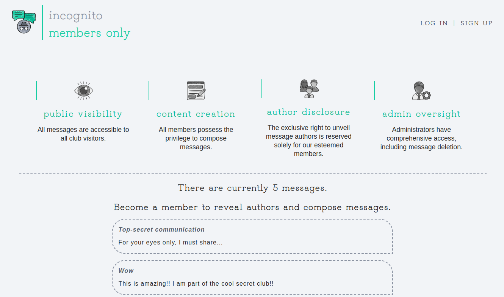
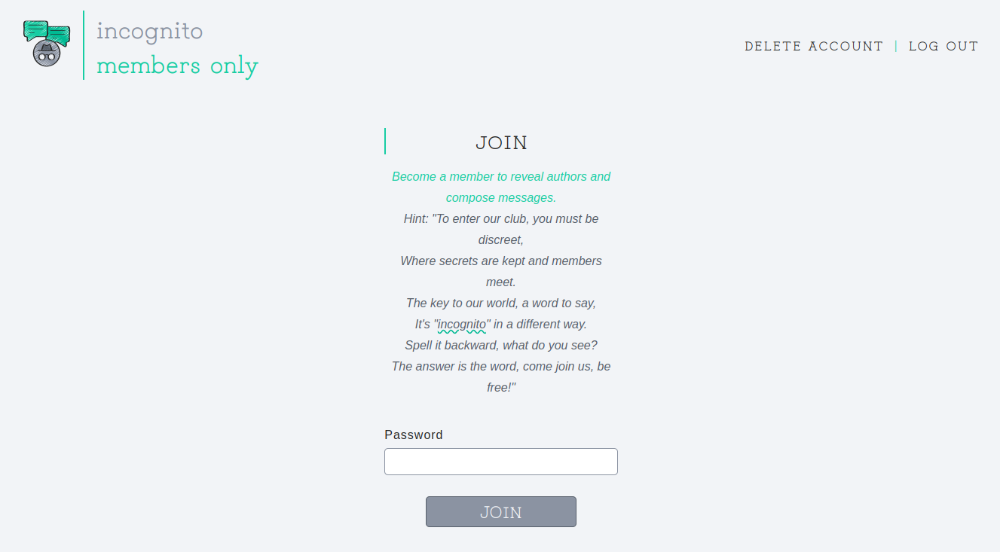
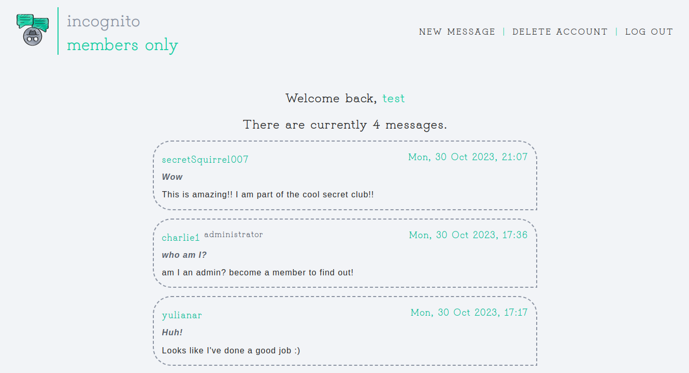
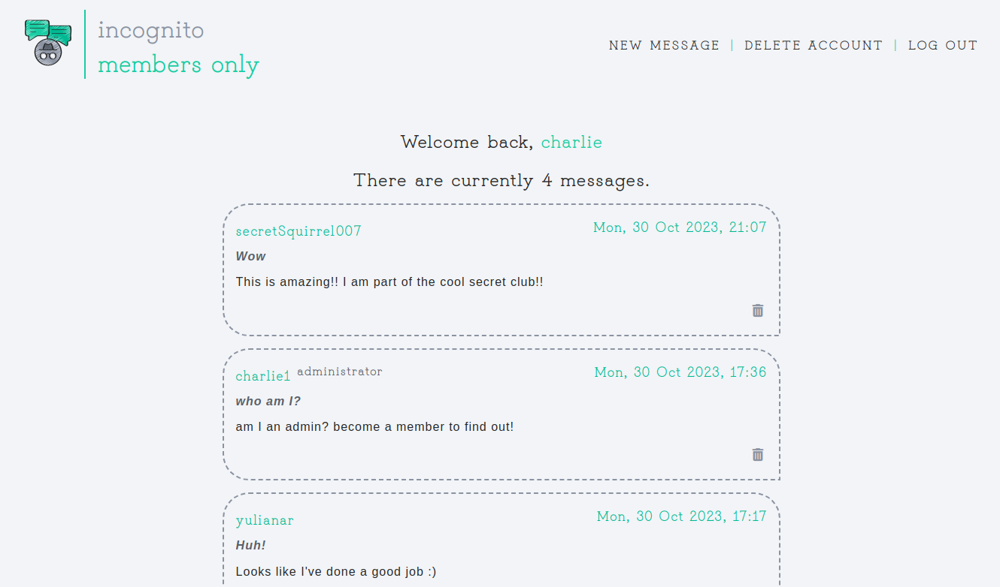

# Members Only

## Introduction

This project is an exclusive clubhouse where visitors can register, become members and leave messages. Visitors and users can only view the message contents, while exclusive members can leave messages and view messages' dates and authors.

This project primarily demonstrates user of NodeJS/ExpressJS, MongoDB (& mongoose), EJS, passportJS and MVC architecture.

**Features include:**

_Visitors:_

- View messages title and content
- Sign up

_Users:_

- Log in
- Become an exclusive member by entering secret password
- Delete their account

_Members:_

- View messages title, content, author and date
- Add message

_Admins:_

- Delete messages

## Preview

> HOME page
> 

> USER view
> 

> MEMBER view
> 

> ADMIN view
> 

## Media & assets credits:

1. Flaticon (Freepik): https://www.flaticon.com/free-icon/incognito

2. Flaticon (juicy_fish): https://www.flaticon.com/free-icons/anonymous

3. Flaticon (juicy_fish): https://www.flaticon.com/free-icon/vision

4. Flaticon (juicy_fish): https://www.flaticon.com/free-icon/blogging

5. Flaticon (juicy_fish): https://www.flaticon.com/free-icon/team

6. Flaticon (juicy_fish): https://www.flaticon.com/free-icon/manager
